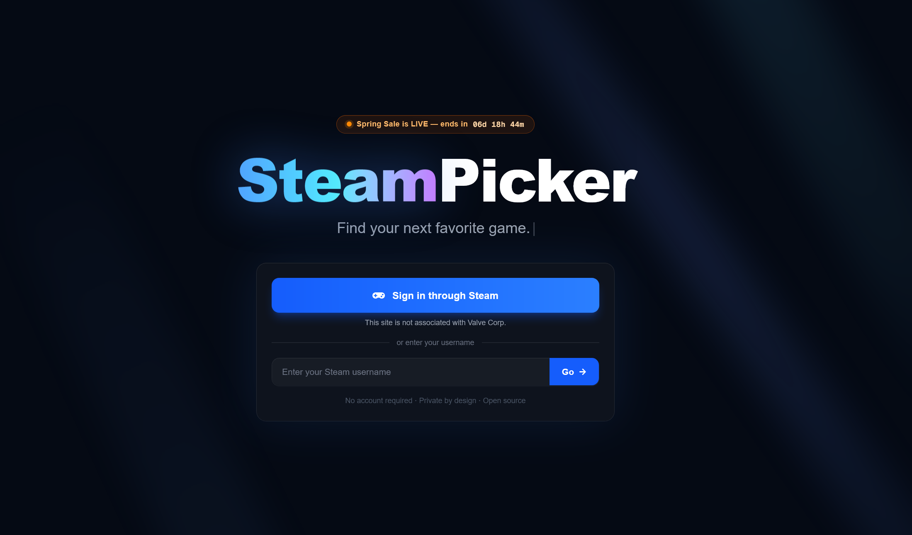

# SteamPicker



**Discover your next favorite game.** SteamPicker analyzes your Steam library and recommends games you'll actually play — powered by Steam's own collaborative filtering algorithm.

**[steampicker.plazor.xyz](https://steampicker.plazor.xyz)**

---

## What it does

- **Smart recommendations** — Uses Steam's "More Like This" algorithm to find games similar to what you actually play, not just what's trending
- **Regional pricing** — Shows prices in your local currency (INR, EUR, GBP, etc.) with real-time sale data
- **Library insights** — Total value, cost per hour, playtime stats, unplayed game count
- **Profile roast** — Generates a shareable roast card that roasts your gaming habits. Download as PNG or share directly to X, WhatsApp, Reddit, Instagram
- **Sale calendar** — Tracks upcoming Steam sales with official Valve dates
- **Tag-based browsing** — Filter recommendations and your library by community tags (Souls-like, Open World, Racing, etc.)

## How recommendations work

Most recommendation engines match by genre tags — that's why you get Goat Simulator recommended when you play open world games. SteamPicker is different.

For each of your most-played games, we fetch Steam's own **"More Like This"** data — the same algorithm that powers the recommendation section on every Steam store page. This is collaborative filtering: games that real players of your favorite games also play and buy.

The result: if you play Helldivers 2, you get Space Marine 2, World War Z, and Risk of Rain 2 — not random sandbox games that happen to share a tag.

## Tech stack

| Layer | Tech |
|-------|------|
| Framework | Next.js 15 (App Router, Turbopack) |
| Language | TypeScript |
| Styling | Tailwind CSS 4 |
| Animations | Framer Motion |
| Data sources | Steam Web API, SteamSpy API, Steam Store API |
| Hosting | Vercel |
| Auth | Steam OpenID |

## Getting started

### Prerequisites

- Node.js 20+
- A [Steam API key](https://steamcommunity.com/dev/apikey)

### Setup

```bash
git clone https://github.com/Plazor26/steam-site.git
cd steam-site
npm install
```

Create `.env.local`:

```env
STEAM_API_KEY=your_key_here
NEXT_PUBLIC_BASE_URL=http://localhost:3000
```

```bash
npm run dev
```

Open [http://localhost:3000](http://localhost:3000).

## Architecture

```
Client (React)
  |
  |-- /api/steam/profile/[steamId]   → Steam Web API (library, playtime)
  |-- /api/steam/catalog             → Steam "More Like This" + SteamSpy enrichment
  |-- /api/steam/enrich              → SteamSpy tags + Steam store page scraping
  |-- /api/steam/value               → Steam appdetails (regional pricing, batched)
  |-- /api/steam/prices              → Proxy for Steam appdetails (CORS)
  |-- /api/steam/meta                → Active/upcoming sale detection
  |-- /api/steam/geo                 → Server-side country detection
  |
  |-- src/lib/prescreener.ts         → Recommendation scoring engine
  |-- src/lib/roast.ts               → Profile roast text generator (200+ templates)
  |-- src/lib/roastCanvas.ts         → Canvas2D roast card renderer (pixel-perfect PNG)
```

## Contributing

Issues and PRs welcome. If you find a bug or have a feature idea, open an issue.

1. Fork the repo
2. Create a feature branch (`git checkout -b feature-name`)
3. Commit your changes
4. Push and open a PR

## License

[MIT](LICENSE)

---

Built by [Plazor](https://plazor.xyz). Not affiliated with Valve Corporation.
